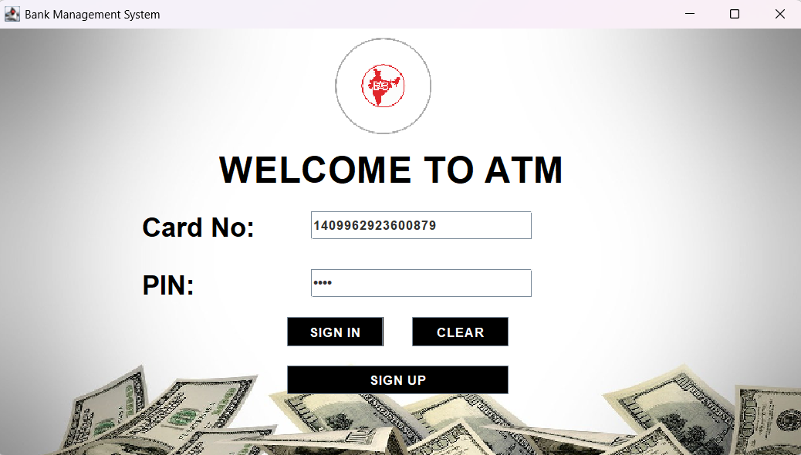
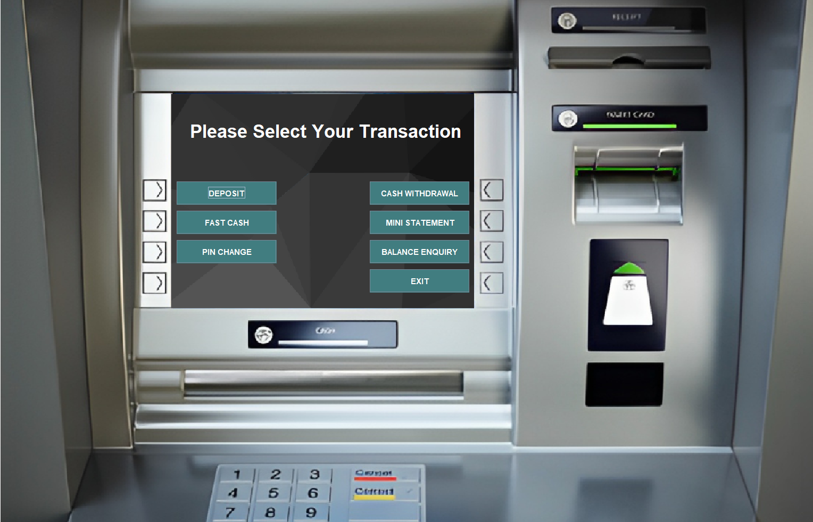
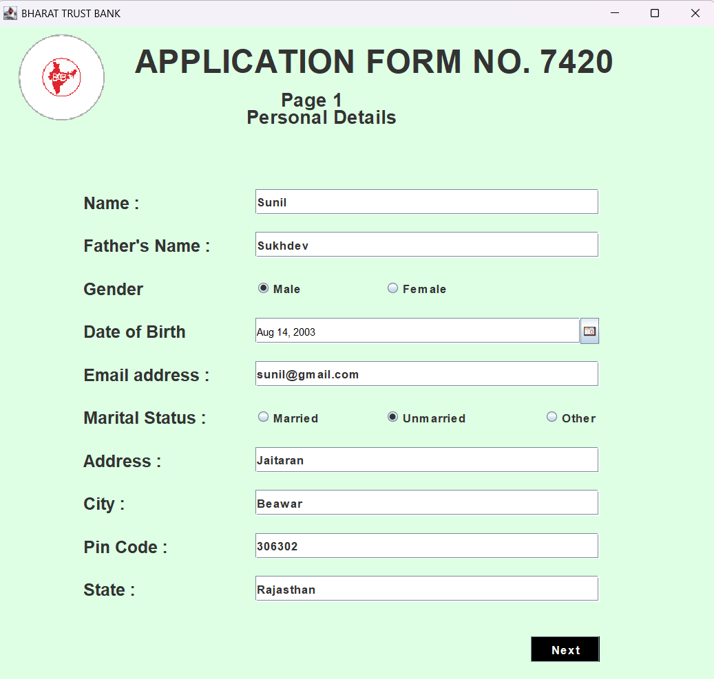
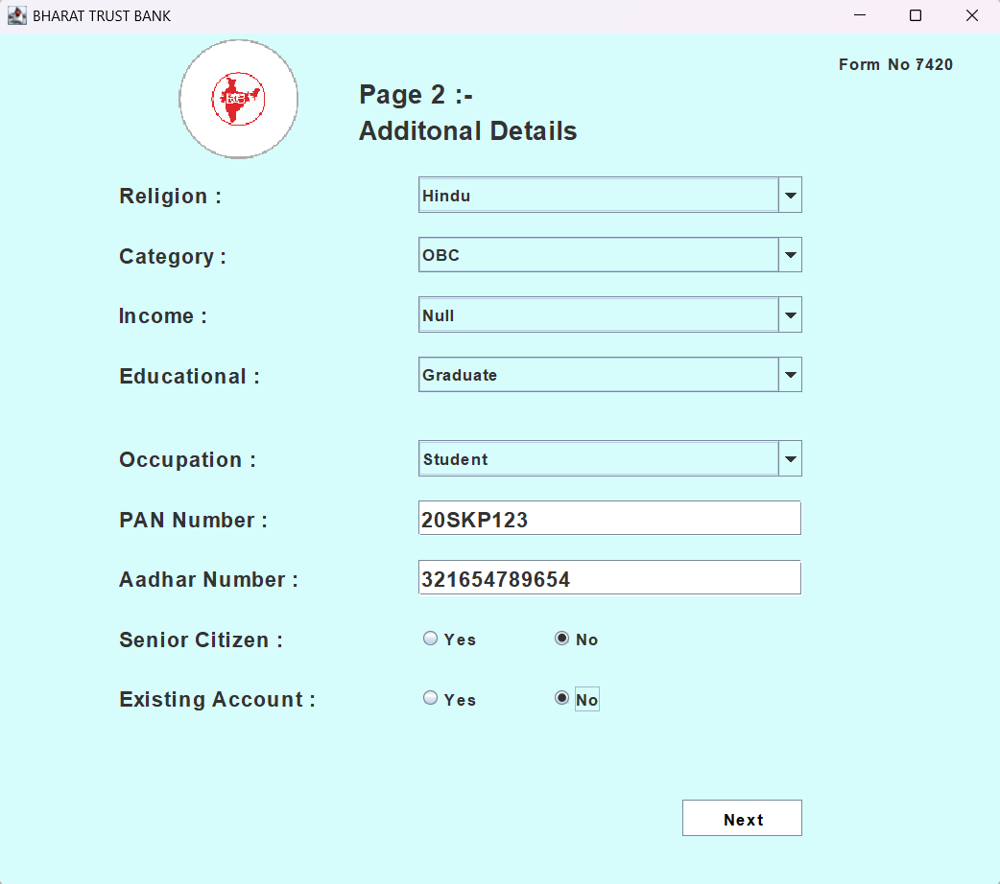
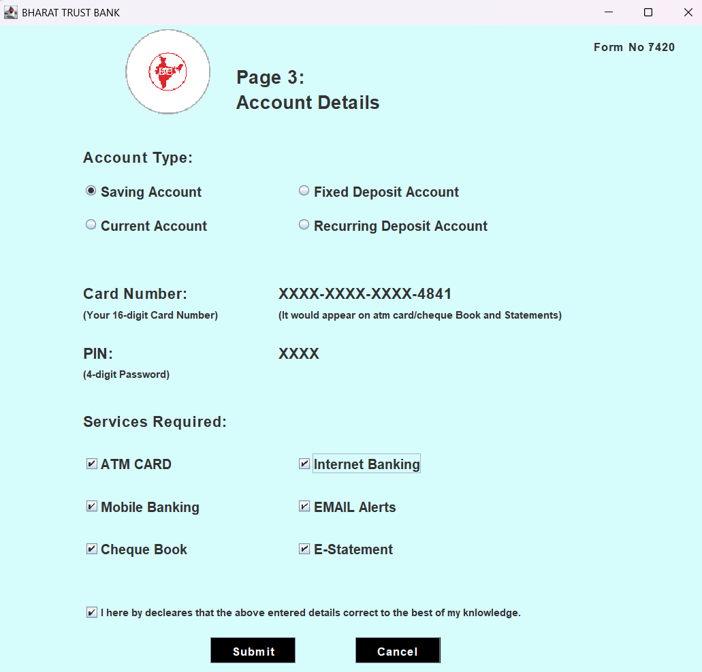
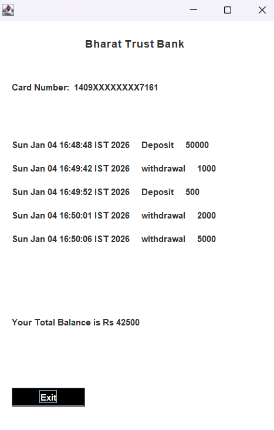

# Bharat Trust Bank – Bank Management System

A Java-based desktop **Bank Management System** developed using **Java Swing** for
the graphical user interface and **JDBC** for database connectivity with
**MySQL Workbench**.

This project simulates real-world banking operations such as user authentication,
account creation, balance enquiry, cash deposit, withdrawal, PIN management,
and fast cash transactions. It demonstrates strong fundamentals of **Core Java**,
**Object-Oriented Programming (OOP)**, **GUI development**, and **database integration**.

---

## 🚀 Features

- User Login with PIN verification  
- New Account / User Signup (Multi-step process)  
- Balance Enquiry  
- Cash Deposit  
- Cash Withdrawal  
- Fast Cash option  
- PIN change functionality  
- JDBC-based MySQL database connectivity  
- GUI-based desktop application using Java Swing  
- Modular and structured Java classes  

---

## 🖼️ Application Screenshots

### 🔐 Login Screen

---

### 🏠 Main Dashboard

---

### 📝 Signup – Page 1

---

### 📝 Signup – Page 2

---

### 📝 Signup – Page 3

---

### 📄 Mini Statement

---

## 🛠️ Technology Stack

| Component | Technology |
|---------|------------|
| Programming Language | Java |
| JDK Version | Java 17 (LTS) |
| GUI | Java Swing |
| Database | MySQL |
| Database Tool | MySQL Workbench |
| Connectivity | JDBC |
| IDE | IntelliJ IDEA / VS Code |
| Version Control | Git & GitHub |

---

## 📦 External Libraries

The project depends on external libraries stored in the **Libraries/** folder.

- **MySQL JDBC Connector**  
  Used to establish JDBC connection between the Java application and the MySQL database.

- **JCalendar Library**  
  Used for date-related UI components during user signup and form handling.

All JAR files must be added to the project build path before running the application.

---

## 🗄️ Database Configuration

The application uses **MySQL** as the backend database, managed using
**MySQL Workbench**.

### Steps to set up the database:

1. Open **MySQL Workbench**
2. Create a new database named: bank_management
3. Execute the SQL file located at: Database for Workbench/MySQL database.sql
4. Ensure JDBC connection details in the Java code (URL, username, password)
match your local MySQL configuration

---

## 🗃️ Database Schema Documentation

The database is designed to support multi-step signup, authentication,
and basic banking transactions.

---

### 📌 Table: `signup`

Stores **basic personal details** collected during **Signup – Page 1**.

| Column Name | Data Type | Description |
|------------|----------|-------------|
| form_no | VARCHAR(30) | Unique signup form number |
| name | VARCHAR(30) | Applicant name |
| father_name | VARCHAR(30) | Father’s name |
| DOB | VARCHAR(30) | Date of birth |
| gender | VARCHAR(30) | Gender |
| email | VARCHAR(60) | Email address |
| marital_status | VARCHAR(30) | Marital status |
| address | VARCHAR(60) | Residential address |
| city | VARCHAR(30) | City |
| pincode | VARCHAR(30) | Postal code |
| state | VARCHAR(30) | State |

---

### 📌 Table: `signuptwo`

Stores **additional personal and financial details** collected during
**Signup – Page 2**.

| Column Name | Data Type | Description |
|------------|----------|-------------|
| form_no | VARCHAR(30) | Signup form number |
| religion | VARCHAR(30) | Religion |
| category | VARCHAR(30) | Category |
| income | VARCHAR(30) | Income range |
| education | VARCHAR(30) | Education qualification |
| occuption | VARCHAR(60) | Occupation |
| pan | VARCHAR(30) | PAN number |
| aadhar | VARCHAR(60) | Aadhar number |
| seniorcitizen | VARCHAR(30) | Senior citizen status |
| existing_account | VARCHAR(30) | Existing bank account (Yes/No) |

---

### 📌 Table: `signupthree`

Stores **account-related details** collected during **Signup – Page 3**.

| Column Name | Data Type | Description |
|------------|----------|-------------|
| form_no | VARCHAR(30) | Signup form number |
| account_Type | VARCHAR(40) | Type of bank account |
| card_number | VARCHAR(30) | Generated debit/ATM card number |
| pin | VARCHAR(30) | Account PIN |
| facility | VARCHAR(200) | Selected banking facilities |

---

### 📌 Table: `login`

Stores **login credentials** used for user authentication.

| Column Name | Data Type | Description |
|------------|----------|-------------|
| form_no | VARCHAR(30) | Signup form number |
| card_number | VARCHAR(50) | Card number |
| pin | VARCHAR(30) | Login PIN |

---

### 📌 Table: `bank`

Stores **all transaction records** such as deposit, withdrawal, and fast cash.

| Column Name | Data Type | Description |
|------------|----------|-------------|
| pin | VARCHAR(10) | Account PIN |
| date | VARCHAR(50) | Transaction date |
| type | VARCHAR(20) | Transaction type |
| amount | VARCHAR(20) | Transaction amount |

---

### 🔗 Database Flow Summary

- User details are collected across three signup tables
- Authentication is handled using the `login` table
- All deposits, withdrawals, and fast cash transactions are stored in the `bank` table
- All database operations are executed using **JDBC**

> ℹ️ **Note:**  
> For simplicity, primary keys and foreign key constraints are not strictly
> enforced in this educational project. In production systems, proper
> constraints and indexing should be applied.

---

## ▶️ How to Run the Project

### Prerequisites
- Java 17 installed and configured
- MySQL Workbench installed
- Database created using the provided SQL file
- External JAR libraries added to the classpath

### Run Steps
1. Open the project in **IntelliJ IDEA** or **VS Code**
2. Configure **Java 17** as the project SDK
3. Add all JAR files from the `Libraries/` folder to the project build path
4. Run `Login.java`  to start the application

---

## 🎯 Project Purpose

This project was developed for academic and practical learning purposes to
demonstrate:

- Core Java programming skills
- Object-Oriented Programming concepts
- GUI development using Java Swing
- Database connectivity using JDBC
- Clean project structure and version control using Git and GitHub

---

## 🔮 Future Enhancements

- Transaction history feature
- Admin dashboard
- Improved validation and exception handling
- Executable JAR packaging
- Refactoring to MVC architecture

---

## 👤 Author

**Sunil Prajapat**  
B.E. Computer Science Engineering  
Chandigarh University

---

## 📜 Disclaimer

This project is developed strictly for educational purposes and is not intended
for production or real banking use.

---

### 🔐 Security Note

- PIN and card details are used strictly for educational purposes
- Database credentials should not be exposed in public repositories
- JDBC credentials should be externalized in real-world systems
- Sensitive data must be encrypted in production applications
